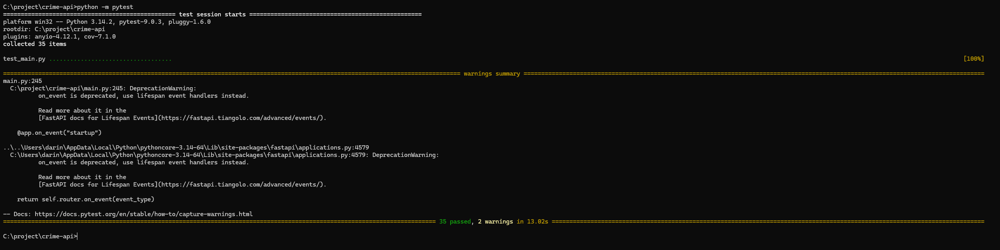
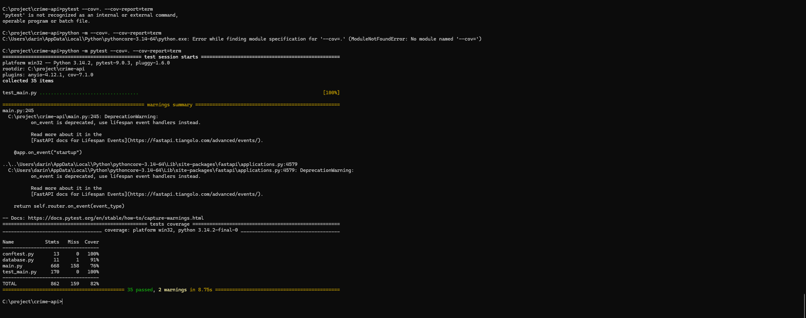
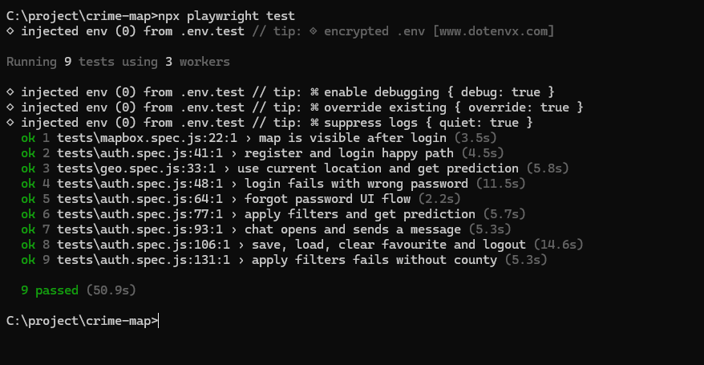
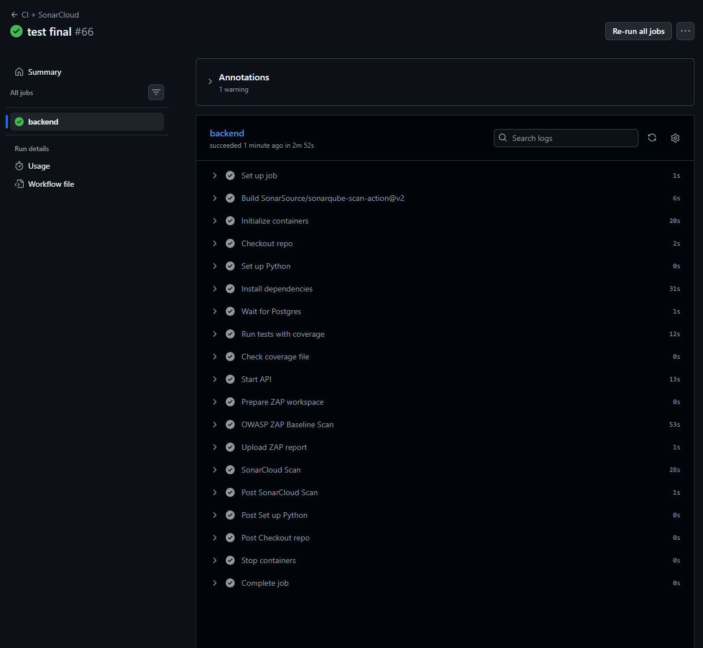
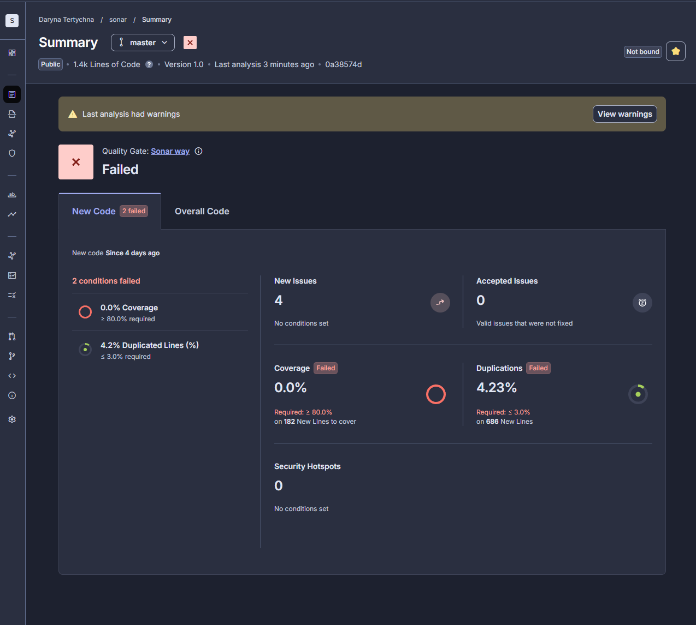
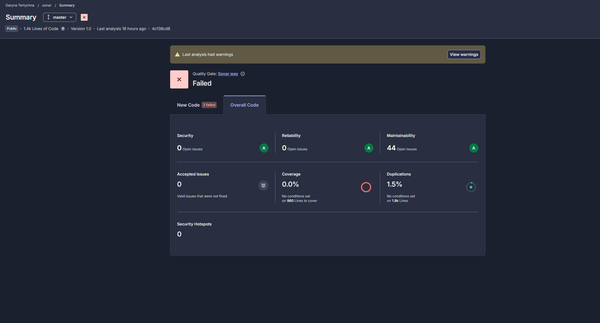
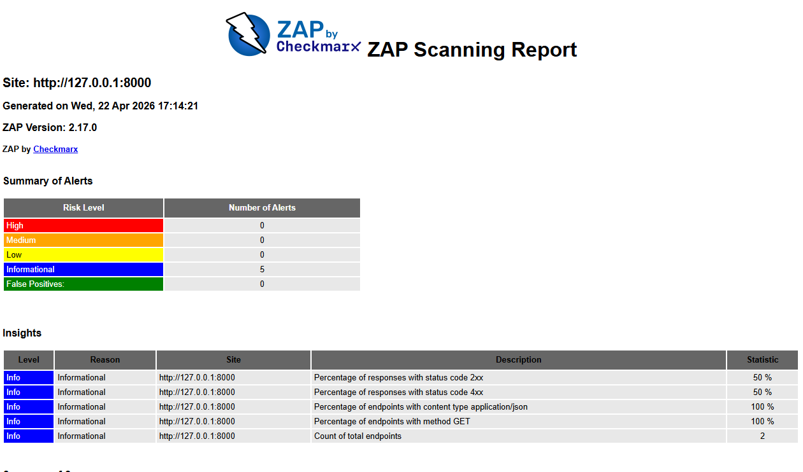

# Crime Risk Analysis and Prediction Map

## Overview

This project is a web application that visualises crime data across Ireland and provides risk predictions based on historical data.

The system allows users to explore crime trends, apply filters, view predictions, save favourite counties, and interact with a chatbot interface for simplified queries.

## Features

* User authentication (register, login, profile)
* Password reset functionality
* Interactive map using Mapbox
* Crime filtering by type, time period, and location
* Machine learning risk prediction (Low / Medium / High)
* Crime statistics (trend, seasonal, totals)
* Chatbot for simplified crime queries

## Tech Stack

### Frontend

* React (Vite)
* Mapbox GL
* Chart visualisation

### Backend

* FastAPI (Python)
* PostgreSQL (user data)
* Pandas (data processing)
* XGBoost (ML model)

### DevOps / Tools

* GitHub Actions (CI)
* SonarCloud (code quality)
* OWASP ZAP (security scan)
* Vercel (frontend deployment)
* Render (backend deployment)

## Architecture

* Frontend hosted on Vercel
* Backend API hosted on Render
* PostgreSQL database stores user data
* Crime datasets stored as CSV files
* ML model loaded from .pkl files for predictions

## Data and Prediction Flow

1. Crime data is loaded from a cleaned CSV dataset
2. Data is processed using Pandas (filtering, grouping, aggregation)
3. Features used for prediction:
   * encoded county
   * encoded crime type
   * previous year crime count
   * year
4. The XGBoost model predicts probabilities for risk levels
5. Probabilities are mapped into:
   * Low
   * Medium
   * High
6. Results are returned via API and visualised in the frontend

## Project Structure

crime-map/
│
├── crime-api/        # FastAPI backend
├── frontend/         # React frontend
├── .github/workflows # CI pipeline
├── README.md

## Live Application

* Frontend: https://crime-map-liard.vercel.app/
* Backend API: https://crime-map-gmyt.onrender.com

## Environment Variables

Backend requires:

SECRET_KEY=
DB_HOST=
DB_PORT=
DB_NAME=
DB_USER=
DB_PASSWORD=
SMTP_HOST=
SMTP_PORT=
SMTP_USER=
SMTP_PASS=
RESET_BASE_URL=
FRONTEND_URL=
STAGING_FRONTEND_URL=

Frontend requires:

VITE_MAPBOX_TOKEN=

## Testing

Backend testing is implemented using pytest.

Run tests:

pytest

With coverage:

pytest --cov=. --cov-report=term

SonarCloud was integrated for static analysis. Some quality gate conditions remained unresolved in the final version, but backend tests, coverage measurement, end to end testing, and OWASP ZAP scanning were completed successfully. 

The analysis identified several maintainability issues, primarily related to:

Missing response documentation in FastAPI endpoints
Use of generic exception handling
Naming convention inconsistencies
Function complexity in specific areas

These issues do not impact the correctness or runtime behaviour of the application. The system is fully tested using unit tests (pytest) and end-to-end tests (Playwright), both of which pass successfully.

All tests were executed locally and through CI to ensure consistency between development and deployment environments.

### Coverage Includes:

* API endpoints
* Prediction logic
* Data loading
* Chat processing
* Authentication
* Location resolution

## CI/CD Pipeline

The project uses GitHub Actions for Continuous Integration.

### Pipeline Location

.github/workflows/ci.yml

### Pipeline Steps

On every push to the `master` branch:

1. Install Python dependencies
2. Run backend tests using pytest
3. Generate coverage report (coverage.xml)
4. Run SonarCloud static code analysis
5. Start backend service
6. Execute OWASP ZAP baseline security scan
7. Upload security reports as artifacts

### Deployment

* Frontend automatically deploys via Vercel
* Backend deploys via Render (connected to GitHub)

### Limitations

* CSV dataset updates are manual
* ML model retraining is not automated

## API Overview

Main endpoints:

* `/auth/register` – user registration
* `/auth/login` – login
* `/predict` – single prediction
* `/predict/all` – predictions across counties
* `/filters/apply` – filtered results
* `/chat/ask` – chatbot interaction
* `/news/crime` – crime news
* `/stats/*` – statistics endpoints
* `/admin/upload-csv` – dataset upload

## Known Limitations

* Crime data is stored in CSV files, not fully in database
* Dataset updates are manual
* Chatbot is rule-based with limited NLP capability
* Predictions depend on historical data quality
* No automated model retraining

## Future Improvements

* Move full dataset into PostgreSQL
* Automate dataset updates
* Improve chatbot with NLP models
* Add scheduled ML retraining
* Improve UI/UX and filtering

## Conclusion

This project demonstrates a full-stack system combining data processing, machine learning, and web development.

It integrates a React frontend with a FastAPI backend, uses PostgreSQL for user management, and applies an XGBoost model to generate crime risk predictions.

The project also includes CI automation, security scanning, and deployment using modern cloud platforms.
